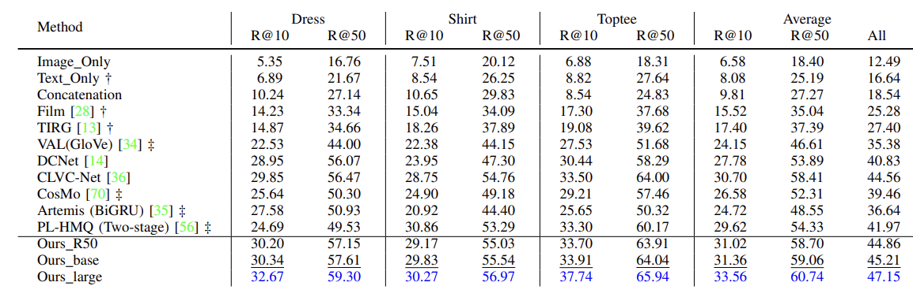

<div align="center">

# Composed Image Retrieval via Cross Relation Network with Hierarchical Aggregation Transformer

<a href="https://pytorch.org/get-started/locally/"></a>
[](https://ieeexplore.ieee.org/abstract/document/10205526)

</div>

## Updates
- :blush: (12/08/2023) Code released!
  
## Abstract
Composing Text and Image to Image Retrieval (CTI-IR) aims at finding the target image, which matches the query image visually along with the query text semantically. However, existing works ignore the fact that the reference text usually serves multiple functions, e.g., modification and auxiliary. To address this issue, we put forth a unified solution, namely Hierarchical Aggregation Transformer incorporated with Cross Relation Network (CRN). CRN unifies modification and relevance manner in a single framework. This configuration shows broader applicability, enabling us to model both modification and auxiliary text or their combination in triplet relationships simultaneously. Specifically, CRN includes: 1) Cross Relation Network comprehensively captures the relationships of various composed retrieval scenarios caused by two different query text types, allowing a unified retrieval model to designate adaptive combination strategies for flexible applicability; 2) Hierarchical Aggregation Transformer aggregates top-down features with Multi-layer Perceptron (MLP) to overcome the limitations of edge information loss in a window-based multi-stage Transformer. Extensive experiments demonstrate the superiority of the proposed CRN over all three fashion-domain datasets.

## Maim requirements:
1. Pytorch-gpu
2. timm (You may need to modify the forword part of Swin_transformer to return all stage outputs.)


## Training scripts used in main experiments
(1) FashionIQ:
Creat files "dress","shirt", and "toptee" to save the outputs.
dress: python train.py --dataset fashioniq --name dress --max_decay_epoch 20 --img_weight 1.0 --class_weight 1.0 --mul_kl_weight 1.0 --model_dir ./dress --num_epochs 50
shirt: python train.py --dataset fashioniq --name shirt --seed 599 --max_decay_epoch 20 --img_weight 1.0 --class_weight 1.0 --mul_kl_weight 1.0 --model_dir ./shirt --num_epochs 50
toptee: python train.py --dataset fashioniq --name toptee --seed 599 --max_decay_epoch 20 --img_weight 1.0 --class_weight 1.0 --mul_kl_weight 1.0 --model_dir ./toptee --num_epochs 50

(2) Shoes:
Creat files "shoes" to save the outputs.
python train.py --dataset shoes --seed 6195 --max_decay_epoch 30 --img_weight 1.0 --class_weight 1.0 --mul_kl_weight 1.0 --model_dir ./shoes --num_epochs 50

(3) Fashion200K:
Creat files "Fashion200k" to save the outputs.
python train.py --dataset fashion200k --seed 6195 --num 1 --img_weight 1.0 --class_weight 1.0 --mul_kl_weight 1.0 --model_dir ./fashion200k --num_epochs 40

## Results



## Citation
If you find this project useful for your research, please use the following BibTeX entry.
```
@ARTICLE{10205526,
  author={Yang, Qu and Ye, Mang and Cai, Zhaohui and Su, Kehua and Du, Bo},
  journal={IEEE Transactions on Image Processing}, 
  title={Composed Image Retrieval via Cross Relation Network with Hierarchical Aggregation Transformer}, 
  year={2023},
  doi={10.1109/TIP.2023.3299791},
  ISSN={1941-0042}}

```
## Acknowledgement
Most of the code modified from ClvcNet [1], thanks!

[1] Wen, Haokun, et al. "Comprehensive linguistic-visual composition network for image retrieval." Proceedings of the 44th International ACM SIGIR Conference on Research and Development in Information Retrieval. 2021.

A detailed README will be updated later. Please stay tuned!